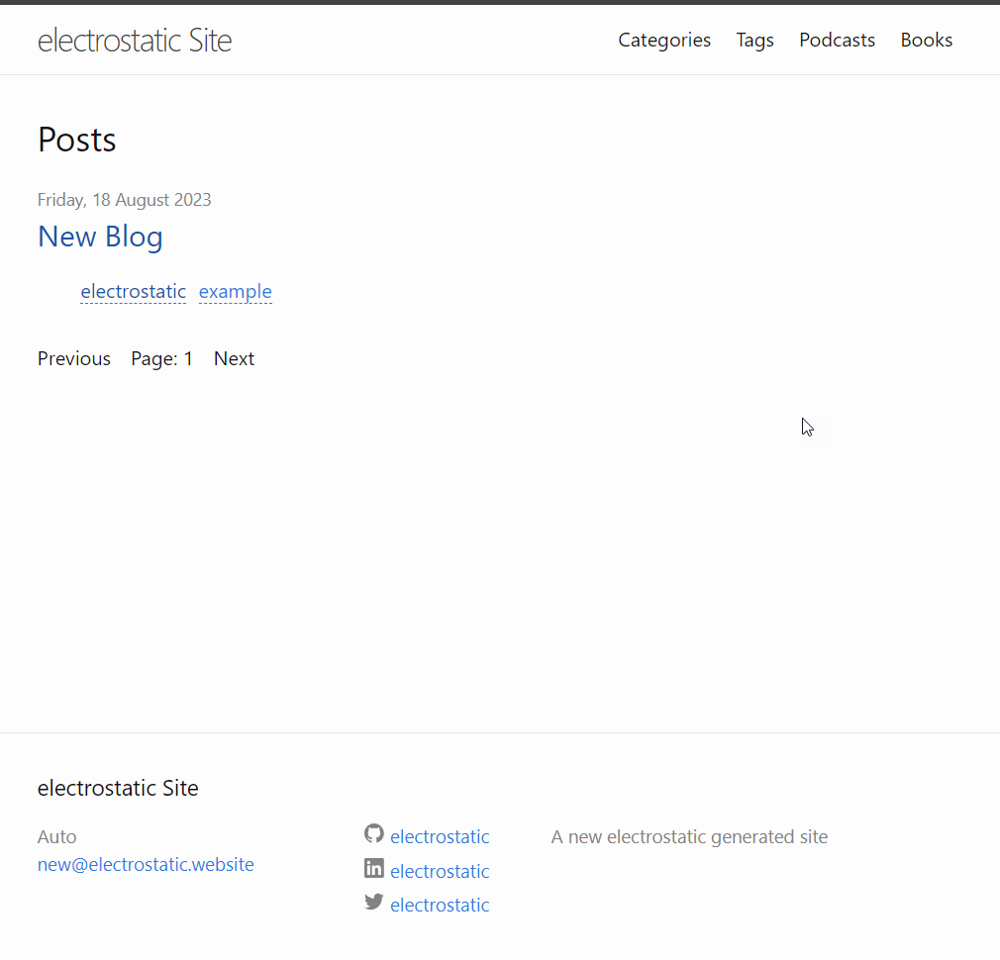

# Electro Static Site Generator 

Generate static web sites using a maven plugin. Functionality written and extendable with Java.

Visit https://electrostatic.run for more a more detailed overview.

# Getting started

## Add the maven plugin

Find the latest version on [maven central](https://)

```xml
<plugin>
    <groupId>run.electrostatic</groupId>
    <artifactId>electrostatic-maven-plugin</artifactId>
    <version>${latest.project.version}</version>
</plugin>
```

## Add some content (optional)

The default theme supports posts. Add a new post with a empty file in the `_posts` directory. Something like `/_posts/2023-08-18-new-blog.md` with the contents:

```text
---
layout: post
title: "New Blog"
date: "2023-08-18"
image: https://placehold.co/600x400/EEE/31343C
tags:
  - electrostatic
  - example
---

# Hello world

Welcome to my place

```

## Build the site

```shell
mvn electrostatic:build
```

Now open the index.html and voila!



# Next steps

Find more documentation on https://electrostatic.run/docs

* Installation
* Electrostatic Maven Plugin
* Architecture
* Themes
