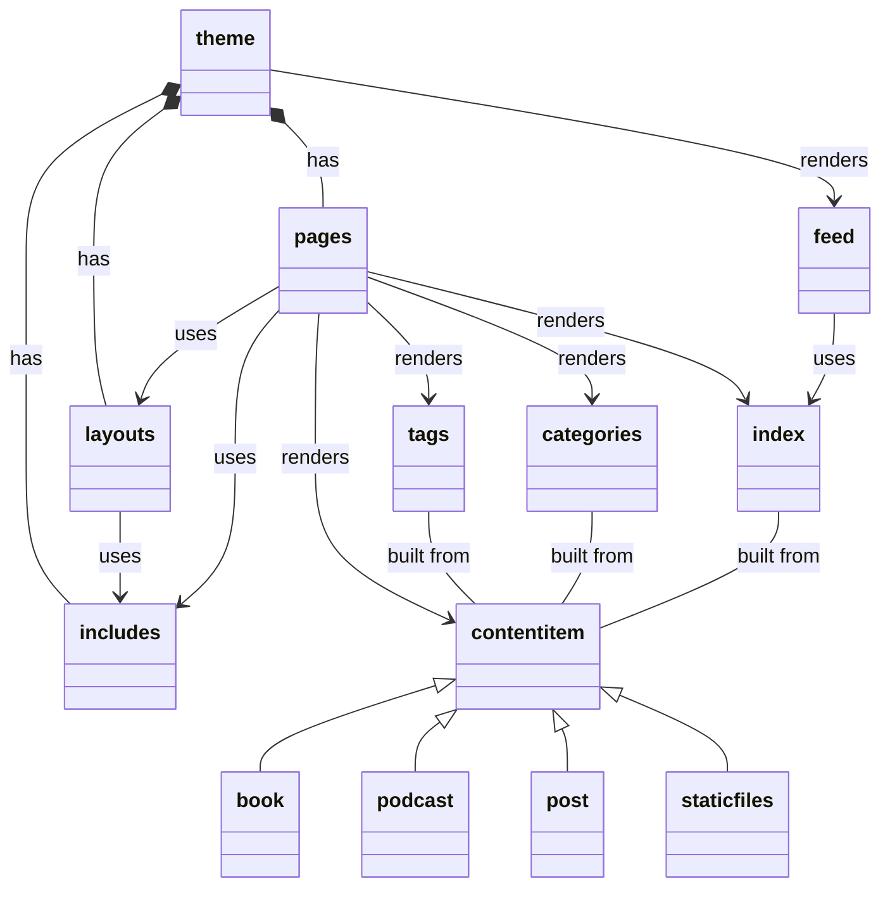
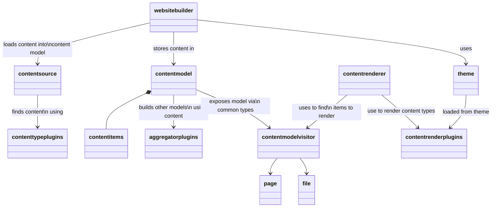

# Electro Static Site Generator 

Generate static web sites using a maven plugin. Functionality written and extendable with Java.

# Getting started

## Add the maven plugin

```xml
<plugin>
    <groupId>website.electrostatic</groupId>
    <artifactId>electrostatic-maven-plugin</artifactId>
    <version>1.0.0</version>
</plugin>
```

Find the latest version on [maven central](https://)

## Add some content (optional)

The default theme supports posts. Add a new post with a empty file in the `_posts` directory. Something like `/_posts/2023-08-18-new-blog.md` with the contents:

```text
---
layout: post
title: "New Blog"
date: "2023-08-18"
image: https://placehold.co/600x400/EEE/31343C
tags:
  - electrostatic
  - example
---

# Hello world

Welcome to my place

```

## Build the site

```shell
mvn clean electrostatic:build
```

Now open the index.html and voila!


# Next steps

Find more documentation on https://electrostatic.website/docs

* Configuration Options
* Theming
* Content types

## Configuration

### Properties

| Name        | Default | Purpose                                                                                                                                         |
|-------------|---------|-------------------------------------------------------------------------------------------------------------------------------------------------|
| environment | local   | Allow plugins to determine behaviour based on the build's target environment. Optionally add analytics for `Production` environment for example |
| drafts | true | Include any draft content in the build                                                                                                          |
| basePackage | ${project.groupId} | Java package containing any configuration, content or extensions |
| themeName | home | Name of theme to apply |


# Design

## Content



## Engine

