# Electrostatic Architecture

This document describes how Electrostatic builds a static site from source content using a plugin-driven core engine, and how CLI, JBang, and Maven wrappers delegate to the same shared services.

For command usage and quick-start examples, see ../README.md.
For release process details, see RELEASE.md.

## Overview

Electrostatic is split into three wrapper surfaces and one shared engine:

- electrostatic-core: build pipeline, content model, plugin contracts, themes, rendering, preview server
- electrostatic-cli: Picocli commands (init, build, serve, themes)
- electrostatic-maven-plugin: Maven goals (init, generate, serve, themes)
- Electrostatic.java + jbang-catalog.json: JBang launcher that forwards to the CLI

All user-facing site behavior is implemented in core and reused by wrappers.

## Module Responsibilities

| Module | Responsibility | Key Entrypoints |
|---|---|---|
| electrostatic-core | Source loading, content aggregation, layout rendering, output writing, preview serving | run.electrostatic.engine.WebSiteBuilder, run.electrostatic.core.SiteGenerator, run.electrostatic.core.SiteInitializer, run.electrostatic.core.SitePreviewServer |
| electrostatic-cli | Terminal UX and argument parsing | run.electrostatic.cli.ElectrostaticCli and command classes |
| electrostatic-maven-plugin | Maven lifecycle integration and goal parameters | run.electrostatic.maven.*Mojo |
| Root JBang launcher | Script entrypoint convenience | Electrostatic.java |

## End-to-End Build Pipeline

The generation flow is orchestrated by WebSiteBuilder.build(GenerationOptions, inputDirectory, outputDirectory).

```mermaid
flowchart LR
  A[Resolve ThemePlugin] --> B[Theme registers plugin instances]
  B --> C[Load site-config.xml into Site]
  C --> D[Run ContentTypePlugin.loadContent]
  D --> E[ContentModel.add triggers AggregatorPlugin.add]
  E --> F[Collect layouts from ContentRenderPlugin.loadLayout]
  F --> G[Clean/Create output directory]
  G --> H[Render pages and static files]
  H --> I[AggregatorPlugin.visit emits generated pages/files]
  I --> J[Write final artifacts to output directory]
```

Detailed stage behavior:

1. Plugin registration
- Active theme calls registerPlugins and pushes implementations into global registries in run.electrostatic.plugins.Plugins.

2. Site configuration loading
- run.electrostatic.site.SitePlugin loads site-config.xml into run.electrostatic.site.Site using JAXB.
- Wrapper-supplied GenerationOptions can override Site.baseUrl for the current run.
- Wrapper-supplied GenerationOptions can also enable draft loading for the current run.

3. Content loading
- run.electrostatic.engine.ContentSource loops through Plugins.contentTypePlugins and calls loadContent for each.
- Content loaders add three kinds of artifacts into ContentModel:
- Pages (already assembled page definitions)
- Content items (domain content that is later rendered as pages)
- Static files (raw bytes copied to output)

4. Aggregation capture and emission
- During load: ContentModel.add(contentItem) immediately calls each AggregatorPlugin.add(contentItem).
- During render traversal: ContentModel.visit invokes AggregatorPlugin.visit(visitor) so aggregators can emit derived pages/files (for example tags and feeds).

5. Layout loading and rendering
- WebSiteBuilder collects layouts from Plugins.contentRenderPlugins.
- run.electrostatic.engine.ContentRenderer walks the model and writes:
- Static files from StaticFile render functions
- Pages and content items transformed to pages
- Layout wrapping with default layout fallback and optional one-level outer layout chaining

## Plugin System

Plugin interfaces live under run.electrostatic.plugins.

| Interface | Registry | Purpose | Typical Built-ins |
|---|---|---|---|
| ThemePlugin | n/a | Registers all plugin implementations for a theme | DefaultThemePlugin, DocsThemePlugin, V2ThemePlugin |
| InitializationPlugin | Plugins.initializationPlugins | Creates scaffold directories/files during init | DefaultThemePlugin, DocsThemePlugin, PostPlugin, StaticFilesPlugin |
| ContentTypePlugin | Plugins.contentTypePlugins | Loads source content into ContentModel | PostPlugin, DraftPostPlugin, BookPlugin, PodcastPlugin, FeedSubscriptionPlugin, DocsCollectionPlugin, StaticFilesPlugin, ClasspathFilesPlugin |
| AggregatorPlugin | Plugins.aggregatorPlugins | Collects content and emits derived artifacts | TagPlugin, FeedPlugin, IndexPlugin, run.electrostatic.posts.PostsPlugin |
| ContentRenderPlugin | Plugins.contentRenderPlugins | Contributes named layouts | DefaultThemePlugin, DocsThemePlugin, V2ThemePlugin |

### Built-in Theme Behavior

DefaultThemePlugin:
- Adds default pages (404, tags, podcasts, books, feeds, posts index)
- Registers post/book/podcast/feed/static/github loaders and tag/feed/index/posts aggregators
- Registers default/home/page/tag/book/podcast/post/posts layouts

DocsThemePlugin:
- Adds docs landing page
- Registers DocsCollectionPlugin plus static/classpath assets
- Registers default/page layouts
- Seeds docs-specific site-config.xml fields and starter section folders

## Content Model and Page Generation

ContentModel stores:

- Page objects: explicit pages created by themes/plugins
- ContentItem objects: source documents parsed by plugins
- StaticFile objects: bytes copied to output

Render traversal order in ContentModel.visit:

1. Render stored pages
2. Convert each ContentItem into a Page and render it
3. Render static files
4. Let aggregator plugins emit additional pages/files

This means aggregators see content items as they are added, then publish final derived artifacts at the end of traversal.

## Markdown, Front Matter, and URL Resolution

Markdown loaders (for example PostPlugin and DocsCollectionPlugin) use CommonMark with:

- YamlFrontMatterExtension for front matter
- HeadingAnchorExtension for heading anchors

Post URL behavior:

- Source: _posts/*.md
- Default output URL is derived from filename
- Front matter slug can override filename-derived slug

Docs section behavior:

- Sections come from Site.docsSections (comma-separated keys)
- Labels come from Site.docsSectionLabels in key=value format, comma-separated
- Each section key maps to an underscored folder (for example guides maps to _guides)
- Each docs entry becomes a page under /docs/{section}/{slug}.html
- A section index page is generated at /docs/{section}/index.html

## Rendering and Layout Composition

run.electrostatic.engine.ContentRenderer performs rendering with run.electrostatic.engine.RenderModel.

RenderModel carries:

- Context (Site and environment)
- Current page
- Current body content
- Full ContentModel for layout queries

Layout flow per page:

1. Run page render function to produce body content
2. Resolve page layout from front matter layout field, defaulting to default
3. Render selected layout with body inserted
4. If the selected layout defines its own layout front matter, wrap once more
5. Write final HTML with doctype to output path

## Theme Resolution

Theme resolution is centralized in run.electrostatic.theme.ThemePlugins:

1. If wrapper provides explicit theme option/property, use it
2. Otherwise, if site-config.xml has theme, use it
3. Otherwise fall back to default

Supported built-in theme IDs:

- default
- docs
- v2

## Wrapper Delegation and Parity

Wrappers call shared core facades rather than implementing generation logic themselves.

| User Surface | Entrypoint | Shared Core Facade |
|---|---|---|
| CLI init | run.electrostatic.cli.InitCommand | SiteInitializer.initialize |
| CLI build | run.electrostatic.cli.BuildCommand | SiteGenerator.generate |
| CLI serve | run.electrostatic.cli.ServeCommand | SitePreviewServer.start |
| Maven init | run.electrostatic.maven.InitMojo | SiteInitializer.initialize |
| Maven generate | run.electrostatic.maven.GenerateMojo | SiteGenerator.generate |
| Maven serve | run.electrostatic.maven.ServeMojo | SitePreviewServer.start |
| JBang command | Electrostatic.java -> ElectrostaticCli.main | same CLI path as above |

Naming difference only:

- CLI/JBang command is build
- Maven goal is generate

Behavior is otherwise shared by common core services.

Both CLI and Maven wrapper surfaces now build a shared GenerationOptions payload before delegating to core. That payload carries the base URL override and the explicit includeDrafts flag, so both wrappers follow the same override semantics and defer to site-config.xml when no base URL is provided.

## Preview Server Architecture

run.electrostatic.core.SitePreviewServer.start does the following:

1. Generates site output first via SiteGenerator
2. Starts JDK HttpServer on the requested port
3. Resolves incoming request paths to files under generated output
4. Falls back to project root for direct file access when present
5. Returns 404 for unresolved files

The preview flow now forwards the same GenerationOptions object used by build generation, so serve-time preview and one-shot generation stay aligned for both baseUrl and draft inclusion.

Serve commands/goals hold the current thread and install a shutdown hook to close the server cleanly.

## Configuration Model

Primary configuration file: site-config.xml at site input root.

Key fields in run.electrostatic.site.Site include:

- title, description, baseUrl, feedUrl
- author and social handles
- theme
- docsSections
- docsSectionLabels

Theme-specific initialization writes starter site-config.xml with defaults so later build/serve runs can auto-resolve theme and docs sections.

## How to Extend

Recommended extension workflow:

1. Create or update a ThemePlugin implementation that owns registration
2. Add one or more ContentTypePlugin implementations for new source folders/formats
3. Add AggregatorPlugin if derived pages/files are needed
4. Add ContentRenderPlugin layouts for new page types
5. Add InitializationPlugin behavior if init should scaffold the new content type
6. Wire the theme into ThemePlugins.resolve if it should be selectable by ID
7. Expose any new user-facing behavior in both CLI and Maven wrapper surfaces

## Known Constraints

- Plugin registries are global static lists; each flow is responsible for clear/register behavior before execution.
- Layout chaining currently supports one outer layout hop in ContentRenderer.
- SitePlugin requires site-config.xml to exist and parse successfully for build/serve flows.

## Related Documentation

- ../README.md for command usage, defaults, and docs-sections examples
- ../electrostatic-core/README.md for minimal builder usage summary
- RELEASE.md for release and publishing workflow
