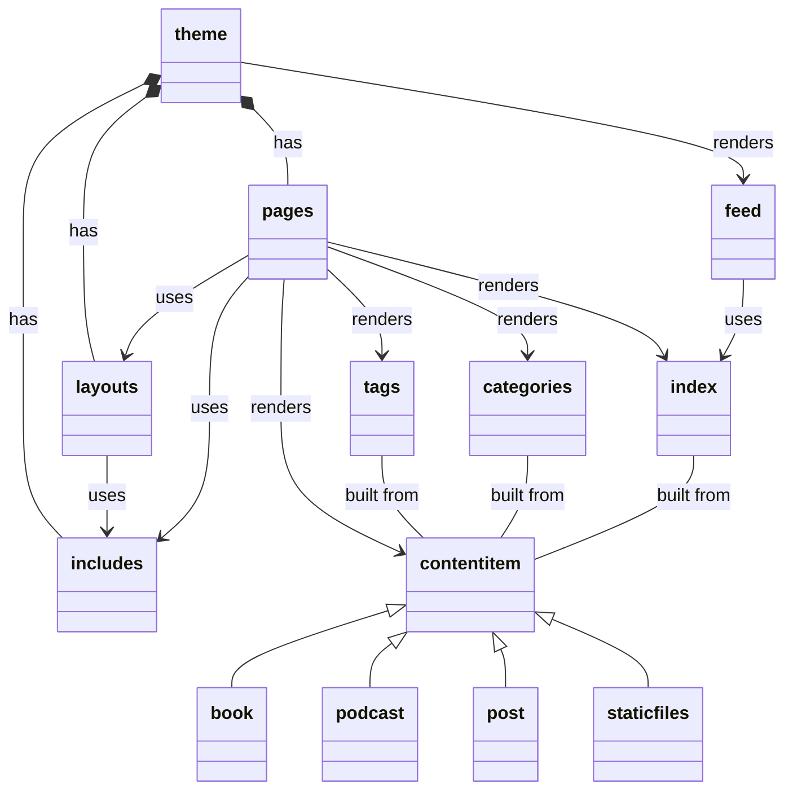
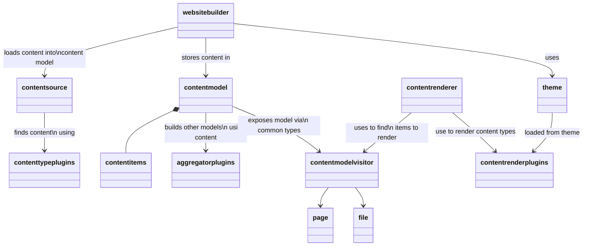

# Getting started with electrostatic


# Installation

If using the default theme, move straight to the [Electrostatic Maven Plugin](#electrostatic-maven-plugin) section, otherwise add a dependency to a theme.

If extending the default theme or building your own from scratch in the project, add the core dependency.

```xml
 <dependency>
    <groupId>website.electrostatic</groupId>
    <artifactId>electrostatic-core</artifactId>
    <version>${project.version}</version>
</dependency>
```

If using a theme, simply add the theme dependency. Refer to the theme's own documentation for registered plugins and configuration.

```xml
 <dependency>
    <groupId>website.electrostatic</groupId>
    <artifactId>electrostatic-xtc-theme</artifactId>
    <version>${project.version}</version>
</dependency>
```

## Electrostatic Maven Plugin

A Maven plugin is available for running the build.

```xml
<build>
    <plugins>
        <plugin>
            <groupId>website.electrostatic</groupId>
            <artifactId>electrostatic-maven-plugin</artifactId>
            <version>${project.version}</version>
        </plugin>
    </plugins>
</build>
```

There are two goals defined by the plugin.

### electrostatic:clean

Clean the named output directory.

### electrostatic:build

Build the site according the Theme's rules. The outputted site will be available in the output directory.

#### Properties

| Name        | Default | Purpose                                                                                                                                         |
|-------------|---------|-------------------------------------------------------------------------------------------------------------------------------------------------|
| environment | local   | Allow plugins to determine behaviour based on the build's target environment. Optionally add analytics for `Production` environment for example |
| drafts | true | Include any draft content in the build                                                                                                          |
| basePackage | ${project.groupId} | Java package containing any configuration, content or extensions |
| themeName | home | Name of theme to apply |


# Architecture

## Content



## Engine



# Themes

## Default Theme (Home)

The Home Theme is available as the default theme included with the electrostatic core module.

### Plugins

* 

## Extend a Theme

## Use your own Theme